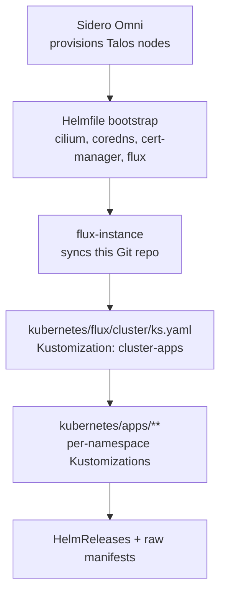

# infra-talos


GitOps for a home Kubernetes cluster: **Talos Linux**, provisioned by **Sidero Omni**,
reconciled by **Flux**. Secrets from **Vaultwarden** via **External Secrets**; updates by
**Renovate**. Layout follows [onedr0p / home-operations](https://github.com/onedr0p/cluster-template):
one Flux `Kustomization` per app → `app/` with a `HelmRelease`.

## Documentation

- **[Application pattern](docs/applications.md)** — how every app is wired, the app inventory, and adding a new one.
- **[Networking & ingress](docs/networking.md)** — Cilium BGP VIPs, Envoy Gateway, external-dns, tunnel, certs.
- **[Storage](docs/storage.md)** — TrueNAS (democratic-csi) for everything stateful; openebs hostpath for Kafka only.
- **[Secrets](docs/secrets.md)** — External Secrets Operator + Vaultwarden.
- **[Bootstrapping](docs/bootstrapping.md)** — standing up a fresh cluster.
- **[Operations & automation](docs/operations.md)** — Renovate, GitHub Actions, Flux webhook, day-2 commands.
- **Runbooks** — [cluster rebuild](docs/runbooks/cluster-rebuild.md), [node loss](docs/runbooks/node-loss.md).
- **[CLAUDE.md](CLAUDE.md)** — conventions + security posture for contributors (incl. AI).

---

## Architecture

Three layers, each owned by a different tool:

| Layer | Tool | Source of truth |
|-------|------|-----------------|
| **1. Machine / OS** | Sidero Omni + Talos | Omni cluster template — in a **separate private repo** (node UUIDs, disk serials, LAN topology are not published here) |
| **2. Cluster prerequisites** | Helmfile | [`bootstrap/helmfile.d/`](bootstrap/helmfile.d) — CNI, DNS, cert-manager, Flux itself |
| **3. Applications** | Flux (GitOps) | [`kubernetes/`](kubernetes) |

This repo owns layers **2 & 3**. Layer 1 lives with the Omni management plane (private).
Once Flux is up it owns everything, including what Helmfile seeded; Helmfile only
exists because Flux can't install itself or the CNI it needs.



## Cluster shape

Node inventory, hardware, disk pinning and machine config: private repo. What this
layer relies on:

- **Mixed arch** (amd64 + arm64): multi-arch images; picky workloads pin `kubernetes.io/arch`.
- **CNI `none`, kube-proxy off, CoreDNS off** at the Talos layer — Cilium and the
  `coredns` app replace them.
- Control planes are schedulable.
- **Coral TPU** (`capability=coral`) and **Intel Arc B580** (`gpu.intel.com/xe`) for
  frigate and ollama.

## Repository layout

```
.
├── bootstrap/helmfile.d/          # Layer 2 — cluster prerequisites (Flux not up yet)
├── kubernetes/                    # Layer 3 — everything Flux reconciles
│   ├── flux/cluster/ks.yaml        # ROOT Kustomization "cluster-apps" → ./kubernetes/apps
│   └── apps/<namespace>/<app>/     # ks.yaml + app/ (HelmRelease, OCIRepository, ExternalSecret, …)
├── docs/                          # the docs linked above + runbooks/
├── .github/workflows/             # labeler, label-sync
├── Taskfile.yaml                  # Omni cred fetch, helmfile bootstrap, Flux/PV ops
├── .renovaterc.json5              # Renovate config
├── CLAUDE.md                      # contributor/AI conventions + security posture
└── .envrc                         # direnv: exports KUBECONFIG
```
