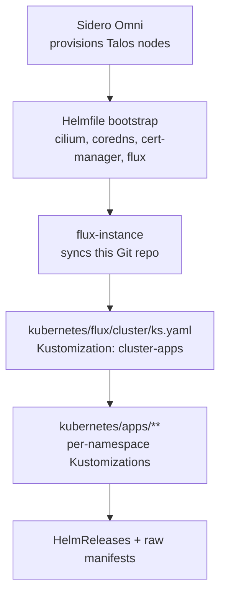

# infra-talos

GitOps configuration for a home Kubernetes cluster running on **Talos Linux**,
provisioned by **Sidero Omni** and continuously reconciled by **Flux**.
Secrets are encrypted at rest with **SOPS + age**; dependency updates are
automated with **Renovate**.

The layout follows the [onedr0p / home-operations](https://github.com/onedr0p/cluster-template)
convention: every application is a self-contained Flux `Kustomization` that
points at an `app/` directory holding a `HelmRelease` (or raw manifests).

---

## Table of contents

- [Architecture](#architecture)
- [Cluster topology](#cluster-topology)
- [Repository layout](#repository-layout)
- [The application pattern](#the-application-pattern)
- [Applications](#applications)
- [Networking & ingress](#networking--ingress)
- [Storage](#storage)
- [Secrets (SOPS)](#secrets-sops)
- [Bootstrapping a cluster](#bootstrapping-a-cluster)
- [Automation](#automation)
- [Common operations](#common-operations)
- [Adding a new application](#adding-a-new-application)

---

## Architecture

Three layers, each owned by a different tool:

| Layer | Tool | Source of truth |
|-------|------|-----------------|
| **1. Machine / OS** | Sidero Omni + Talos | [`bootstrap/temp-cluster/omni-cluster.yaml`](bootstrap/temp-cluster/omni-cluster.yaml) + patches under [`bootstrap/temp-cluster/patches/`](bootstrap/temp-cluster/patches) |
| **2. Cluster prerequisites** | Helmfile | [`bootstrap/helmfile.d/`](bootstrap/helmfile.d) — CNI, DNS, cert-manager, Flux itself |
| **3. Applications** | Flux (GitOps) | [`kubernetes/`](kubernetes) |

Once layer 3 is up, **Flux owns everything** — including the components that
were seeded by Helmfile in layer 2. The Helmfile step exists only to break the
chicken-and-egg problem of installing Flux (and the CNI it needs) before Flux
exists to install them.



---

## Cluster topology

Defined in [`bootstrap/temp-cluster/omni-cluster.yaml`](bootstrap/temp-cluster/omni-cluster.yaml).
Control planes are schedulable (`allowSchedulingOnControlPlanes: true`), so the
master/worker split is logical rather than a hard workload boundary.

| Node | Role | Install disk | Notable extensions / capability |
|------|------|--------------|---------------------------------|
| `mini-talos-01` | control-plane | `/dev/sda` (SATA) | qemu-guest-agent, iscsi-tools |
| `mini-talos-02` | control-plane | `/dev/sda` (Proxmox) | qemu-guest-agent, iscsi-tools |
| `mini-talos-03` | control-plane | NVMe (by-id) | qemu-guest-agent, iscsi-tools |
| `turing-01` | worker | NVMe | **Coral TPU** (`gasket-driver`, label `capability=coral`), iscsi-tools |
| `turing-03` | worker | NVMe | iscsi-tools |
| `mini-talos-04` | worker | `/dev/nvme0n1` | **Intel iGPU** (`i915`), qemu-guest-agent, iscsi-tools |
| ~~`turing-04` (CM4)~~ | worker | — | commented out |

**Cluster-wide Talos settings** ([`patches/controller/cluster-patch.yaml`](bootstrap/temp-cluster/patches/controller/cluster-patch.yaml)):

- **CNI: `none`** and **kube-proxy: disabled** — Cilium replaces both.
- **CoreDNS: disabled** — deployed as an app instead (`kube-system/coredns`).
- `enableWorkloadProxy` + embedded discovery service (Omni features).
- etcd metrics exposed on `:2381`, advertised subnet `10.1.80.0/24`.
- Aggregator routing + controller/scheduler/etcd metrics bind on `0.0.0.0`
  (so Prometheus can scrape them).

Global machine patches live in [`patches/global/`](bootstrap/temp-cluster/patches/global):
disk encryption, kubelet, network, sysctls, time, and extra files.

---

## Repository layout

```
.
├── bootstrap/                     # Layer 1 & 2 — cluster does not exist yet
│   ├── temp-cluster/
│   │   ├── omni-cluster.yaml        # Omni cluster template (nodes, disks, versions)
│   │   └── patches/                 # Talos config patches — MUST live under the template dir
│   │       ├── global/              #   applied to ALL nodes
│   │       └── controller/          #   applied to control planes only
│   └── helmfile.d/
│       ├── 00-crds.yaml            # CRDs only (external-dns, envoy-gateway, grafana, kps)
│       ├── 01-apps.yaml            # cilium → coredns → cert-manager → flux-operator → flux-instance
│       └── templates/values.yaml.gotmpl   # reuses each app's HelmRelease values (see below)
│
├── kubernetes/                    # Layer 3 — everything Flux reconciles
│   ├── flux/cluster/ks.yaml        # ROOT Kustomization "cluster-apps" → ./kubernetes/apps
│   ├── components/sops/            # reusable Kustomize component injecting cluster-secrets
│   └── apps/<namespace>/           # one directory per namespace
│       ├── namespace.yaml
│       ├── kustomization.yaml       # lists the namespace's apps + sops component
│       └── <app>/
│           ├── ks.yaml              # Flux Kustomization for this app
│           └── app/                 # HelmRelease, OCIRepository, secrets, extra manifests
│
├── Taskfile.yaml                  # task runner — Omni + helmfile bootstrap helpers
├── .sops.yaml                     # SOPS encryption rules
├── .renovaterc.json5              # Renovate config
└── .envrc                         # direnv: exports SOPS_AGE_KEY_FILE + KUBECONFIG
```

---

## The application pattern

Every app is reconciled through the same chain. Using `cert-manager` as the
example:

1. **Root Kustomization** — [`kubernetes/flux/cluster/ks.yaml`](kubernetes/flux/cluster/ks.yaml)
   defines `cluster-apps`, pointing at `./kubernetes/apps`. It applies **global
   defaults to every child** via `patches`: SOPS decryption, and a `HelmRelease`
   patch that sets install/upgrade/rollback remediation (retry, `cleanupOnFail`,
   `CreateReplace` CRDs).

2. **Namespace Kustomization** — [`kubernetes/apps/cert-manager/kustomization.yaml`](kubernetes/apps/cert-manager/kustomization.yaml)
   lists `namespace.yaml` and each app's `ks.yaml`, and pulls in the
   `../../components/sops` component so `cluster-secrets` is available.

3. **App Kustomization (`ks.yaml`)** — [`kubernetes/apps/cert-manager/cert-manager/ks.yaml`](kubernetes/apps/cert-manager/cert-manager/ks.yaml)
   is a Flux `Kustomization` that:
   - points `path` at the app's `app/` directory,
   - declares `healthChecks` (Flux waits for the HelmRelease + ClusterIssuer),
   - runs `postBuild.substituteFrom` against the `cluster-secrets` Secret, so
     manifests can reference `${SECRET_DOMAIN}` and friends.

4. **The `app/` directory** holds the actual resources: an `OCIRepository`
   (the Helm chart, pinned by tag), a `HelmRelease` referencing it, encrypted
   `*.sops.yaml` secrets, and any extra CRs (ClusterIssuer, HTTPRoute, …).

Charts are pulled as **OCI artifacts** (`OCIRepository`) rather than classic
Helm repositories.

---

## Applications

| Namespace | Apps | Purpose |
|-----------|------|---------|
| `kube-system` | cilium, coredns, metrics-server, reloader | CNI + LB, cluster DNS, HPA metrics, config-change restarts |
| `cert-manager` | cert-manager | ACME (Let's Encrypt) + internal CA |
| `network` | envoy-gateway, cloudflare-dns, unifi-dns, cloudflare-tunnel | Gateway API ingress, external-dns (Cloudflare + UniFi), Cloudflare tunnel |
| `observability` | kube-prometheus-stack, grafana | Metrics/alerting stack, Grafana (via grafana-operator) |
| `democratic-csi` | iscsi, nfs | TrueNAS-backed persistent storage (iSCSI + NFS) |
| `openebs` | openebs | Local-path persistent volumes |
| `frigate` | frigate | NVR — uses the Coral TPU; raw manifests (not Helm) |
| `flux-system` | flux-operator, flux-instance | Flux itself + monitoring dashboards |
| `default` | echo | Ingress/connectivity smoke test |

---

## Networking & ingress

- **LoadBalancer IPs** — Cilium LB IPAM, pool `10.1.80.0/24`, announced over
  L2 on `ens*`/`eth*` interfaces
  ([`cilium/app/networks.yaml`](kubernetes/apps/kube-system/cilium/app/networks.yaml)).
- **Gateways** (Envoy Gateway, Gateway API) —
  [`envoy-gateway/gateway/`](kubernetes/apps/network/envoy-gateway/gateway):
  - `envoy-internal` → `10.1.80.11`, host `internal.${SECRET_DOMAIN}`
  - `envoy-external` → `10.1.80.12`, host `external.${SECRET_DOMAIN}`
  - both terminate TLS with the `${SECRET_DOMAIN}-production-tls` wildcard cert.
    Apps attach via `HTTPRoute` (see each app's `httproute.yaml`).
- **DNS** — `external-dns` publishes gateway hostnames to **Cloudflare**
  (`cloudflare-dns`) and **UniFi** (`unifi-dns`).
- **External access** — `cloudflare-tunnel` (cloudflared) exposes selected
  services without opening ports.
- **Certificates** — cert-manager `letsencrypt-production` ClusterIssuer
  (DNS-01 over 1.1.1.1) plus an `internal-ca` issuer.

---

## Storage

- **openebs** — node-local volumes for scratch / non-replicated data.
- **democratic-csi** — dynamic PVs backed by a **TrueNAS** appliance over
  **iSCSI** (block) and **NFS** (shared). TrueNAS credentials are in each app's
  `secretstruenas.sops.yaml`. See [`democratic-csi/README.md`](kubernetes/apps/democratic-csi/README.md).

---

## Secrets (SOPS)

Encryption is handled by [SOPS](https://github.com/getsops/sops) with an
**age** key. Rules live in [`.sops.yaml`](.sops.yaml):

- `*.sops.yaml` under `bootstrap/` and `kubernetes/` encrypt only
  `data` / `stringData` / `driver` fields (keys stay readable in diffs).
- `talos/*.sops.yaml` are fully encrypted (see note in Bootstrapping).

Flow:

1. The private age key lives **outside the repo**; `.envrc` exports
   `SOPS_AGE_KEY_FILE` (via direnv) so `sops` can decrypt locally.
2. In-cluster, the `sops-age` Secret in `flux-system` lets the Flux
   **kustomize-controller** decrypt at reconcile time
   (`--sops-age-secret=sops-age`, wired in the flux-instance patches).
3. Non-secret, cluster-wide values (e.g. `SECRET_DOMAIN`) live in
   [`components/sops/cluster-secrets.sops.yaml`](kubernetes/components/sops/cluster-secrets.sops.yaml)
   and are injected into manifests via `postBuild.substituteFrom`.

> The public age recipient is committed in `.sops.yaml`; the matching private
> key is the one secret you must supply out-of-band to bootstrap or decrypt.

---

## Bootstrapping a cluster

**Provisioning is done through Sidero Omni** (`omnictl`), not talhelper.

```sh
# 1. Provision / update Talos nodes via Omni
omnictl get machine                                                   # list registered machines
omnictl cluster template validate -f bootstrap/temp-cluster/omni-cluster.yaml
omnictl cluster template sync     -f bootstrap/temp-cluster/omni-cluster.yaml

# 2. Install CRDs (external-dns, envoy-gateway, kube-prometheus-stack, grafana-operator)
helmfile --file bootstrap/helmfile.d/00-crds.yaml template \
  | yq ea 'select(.kind == "CustomResourceDefinition")' \
  | kubectl apply --server-side -f -

# 3. Install cluster prerequisites (cilium → coredns → cert-manager → flux-operator → flux-instance)
helmfile --file bootstrap/helmfile.d/01-apps.yaml sync
```

After step 3, `flux-instance` clones this repo and Flux reconciles
`kubernetes/apps/**` on its own.

> **Omni ≥ 1.8 template containment:** since v1.8.0 a cluster template may only
> include files from within the template file's own directory tree. That is why
> every patch lives under `bootstrap/temp-cluster/patches/` (referenced as
> `patches/global/…`, not `../global/…`). Because nothing escapes the template
> dir, `omnictl cluster template sync` needs **no** `--allowed-dir` flag.

**Why the Helmfile values are never duplicated:**
[`templates/values.yaml.gotmpl`](bootstrap/helmfile.d/templates/values.yaml.gotmpl)
reads each release's values straight out of its Flux `HelmRelease`
(`kubernetes/apps/<ns>/<app>/app/helmrelease.yaml`). Bootstrap and steady-state
therefore use **identical** configuration.

### Via Task

Every step is wrapped as a [Task](https://taskfile.dev) target — run `task`
to list them:

| Task | Does |
|------|------|
| `task cluster:validate` | Validate the Omni cluster template |
| `task cluster:sync` | Provision / update nodes (validates first) |
| `task cluster:kubeconfig` | Fetch the kubeconfig into `./kubeconfig` |
| `task bootstrap` | Install CRDs, then cluster prerequisites |
| `task reconcile` | Force a Flux sync from Git |
| `task cluster:delete` | Tear the cluster down (destructive, prompts) |

> The `talos/*` rule in [`.sops.yaml`](.sops.yaml) is an unused leftover from an
> earlier talhelper setup and can be dropped.

---

## Automation

- **Renovate** ([`.renovaterc.json5`](.renovaterc.json5)) — runs on weekends,
  pins GitHub Action digests, groups the Flux operator/instance releases, and
  writes [Conventional Commits](https://www.conventionalcommits.org/) with
  type/scope + `type/*` and `renovate/*` labels. Custom managers pick up
  `# renovate:`-annotated versions and any `oci://…:tag` reference.
- **GitHub Actions** ([`.github/workflows/`](.github/workflows)) —
  `labeler` (PR labels by path) and `label-sync` (keeps repo labels in sync
  with [`.github/labels.yaml`](.github/labels.yaml)).
- **Flux webhook** — a `Receiver`
  ([`flux-instance/app/receiver.yaml`](kubernetes/apps/flux-system/flux-instance/app/receiver.yaml))
  reconciles immediately on `push` instead of waiting for the poll interval.

---

## Common operations

Requires `kubectl` + `flux` against the cluster (`.envrc` sets `KUBECONFIG`).

```sh
# Force-reconcile the whole tree from Git
flux reconcile source git flux-system -n flux-system
flux reconcile kustomization cluster-apps -n flux-system --with-source

# Reconcile / suspend / resume a single app
flux reconcile kustomization <app> -n flux-system
flux suspend   kustomization <app> -n flux-system
flux resume    kustomization <app> -n flux-system

# See what's failing
flux get kustomizations -A
flux get helmreleases -A

# Edit an encrypted secret in place
sops kubernetes/apps/<ns>/<app>/app/secret.sops.yaml
```

---

## Adding a new application

1. Create `kubernetes/apps/<namespace>/<app>/` with an `app/` subdirectory.
2. In `app/`, add an `OCIRepository` (chart), a `HelmRelease` referencing it,
   an `app/kustomization.yaml` listing the files, and any secrets as
   `*.sops.yaml` (encrypt with `sops -e -i`).
3. Add `ks.yaml` (Flux `Kustomization`) pointing `path` at the `app/` dir; add
   `healthChecks` and `postBuild.substituteFrom: cluster-secrets` as needed.
4. Reference the new `ks.yaml` from the namespace's `kustomization.yaml`
   (create `namespace.yaml` + the namespace `kustomization.yaml` if the
   namespace is new).
5. Commit and push — the Flux `Receiver` triggers reconciliation. Copy an
   existing app (e.g. `cert-manager`) as a template.
```
