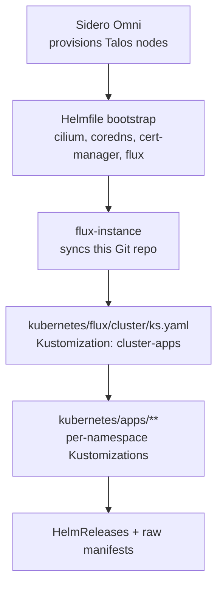

# infra-talos


GitOps configuration for a home Kubernetes cluster running on **Talos Linux**,
provisioned by **Sidero Omni** and continuously reconciled by **Flux**.
Secrets are pulled from **Vaultwarden** via the **External Secrets Operator**;
dependency updates are automated with **Renovate**.

The layout follows the [onedr0p / home-operations](https://github.com/onedr0p/cluster-template)
convention: every application is a self-contained Flux `Kustomization` that
points at an `app/` directory holding a `HelmRelease` (or raw manifests).

## Documentation

- **[Application pattern](docs/applications.md)** — how every app is wired, the app inventory, and adding a new one.
- **[Networking & ingress](docs/networking.md)** — Cilium LB, Envoy Gateway, external-dns, Cloudflare tunnel, certs.
- **[Storage](docs/storage.md)** — TrueNAS (democratic-csi) for everything stateful; openebs hostpath for Kafka only.
- **[Secrets](docs/secrets.md)** — External Secrets Operator + Vaultwarden.
- **[Bootstrapping](docs/bootstrapping.md)** — standing up a fresh cluster.
- **[Operations & automation](docs/operations.md)** — Renovate, GitHub Actions, Flux webhook, day-2 commands.
- **Runbooks** — [cluster rebuild](docs/runbooks/cluster-rebuild.md), [node loss](docs/runbooks/node-loss.md).
- **[CLAUDE.md](CLAUDE.md)** — conventions + security posture for contributors (incl. AI).

---

## Architecture

Three layers, each owned by a different tool:

| Layer | Tool | Source of truth |
|-------|------|-----------------|
| **1. Machine / OS** | Sidero Omni + Talos | Omni cluster template — in a **separate private repo** (node UUIDs, disk serials, LAN topology are not published here) |
| **2. Cluster prerequisites** | Helmfile | [`bootstrap/helmfile.d/`](bootstrap/helmfile.d) — CNI, DNS, cert-manager, Flux itself |
| **3. Applications** | Flux (GitOps) | [`kubernetes/`](kubernetes) |

This repo owns layers **2 & 3** (public GitOps). Layer 1 — node provisioning via
Sidero Omni — lives in a private repo alongside the Omni management plane.

Once layer 3 is up, **Flux owns everything** — including the components that
were seeded by Helmfile in layer 2. The Helmfile step exists only to break the
chicken-and-egg problem of installing Flux (and the CNI it needs) before Flux
exists to install them.



## Cluster shape

Provisioned by Sidero Omni. The node inventory, hardware, disk pinning, and Talos
machine config live in a **separate private repo** — not published here. What the
GitOps layer in this repo relies on:

- **Mixed architecture** (amd64 + arm64) — charts/images must be multi-arch;
  arch-picky workloads pin `kubernetes.io/arch` via nodeSelector.
- **CNI `none` + kube-proxy disabled** at the Talos layer — Cilium replaces both
  (`kube-system/cilium`).
- **CoreDNS disabled** at the Talos layer — deployed as an app instead
  (`kube-system/coredns`).
- Control planes are schedulable, so master/worker is logical, not a hard boundary.
- A **Coral TPU** (`capability=coral`) and an **Intel Arc B580** (`gpu.intel.com/xe`)
  are exposed to the workloads that select them (frigate, ollama).

## Repository layout

```
.
├── bootstrap/helmfile.d/          # Layer 2 — cluster prerequisites (Flux not up yet)
├── kubernetes/                    # Layer 3 — everything Flux reconciles
│   ├── flux/cluster/ks.yaml        # ROOT Kustomization "cluster-apps" → ./kubernetes/apps
│   └── apps/<namespace>/<app>/     # ks.yaml + app/ (HelmRelease, OCIRepository, ExternalSecret, …)
├── docs/                          # the docs linked above + runbooks/
├── .github/workflows/             # labeler, label-sync
├── Taskfile.yaml                  # Omni cred fetch, helmfile bootstrap, Flux/PV ops
├── .renovaterc.json5              # Renovate config
├── CLAUDE.md                      # contributor/AI conventions + security posture
└── .envrc                         # direnv: exports KUBECONFIG
```

See **[docs/applications.md](docs/applications.md)** for the per-app pattern
(`ks.yaml` → `app/` with OCIRepository + HelmRelease + ExternalSecret).
