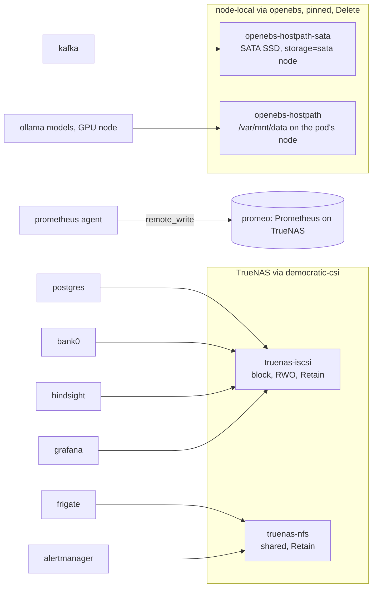

# Storage

Two providers. State sits on TrueNAS. Node-local disk is for the two
workloads where disk speed beats durability: Kafka (accepts loss) and the
Ollama model cache (re-pullable). iSCSI tops out at 1GbE line rate, ~125 MB/s.



- **democratic-csi** - dynamic PVs from a TrueNAS appliance over iSCSI (block)
  and NFS (shared). TrueNAS credentials come from Vaultwarden via an
  `ExternalSecret`; setup in [democratic-csi/README.md](../kubernetes/apps/democratic-csi/README.md).
  Both classes use `reclaimPolicy: Retain`, so deleting a PVC or the cluster
  never deletes data.
- **openebs** - node-local `hostpath` volumes. A PV here is pinned to the node
  that created it and dies with that node. Two consumers: Kafka through
  `openebs-hostpath-sata` (`/var/mnt/sata` on the node labelled
  `storage=sata`), and the Ollama model cache through the default
  `openebs-hostpath` (`/var/mnt/data`, on whichever node the pod lands - the
  GPU node, by its `nodeSelector`; that node has no separate `data` volume, so
  the directory lives on Talos' EPHEMERAL NVMe partition).
- **Metrics** are not stored in-cluster. Prometheus runs in agent mode and
  remote-writes to `promeo`, a Prometheus on TrueNAS; Thanos Ruler evaluates
  the `PrometheusRule`s against it and alerts into the in-cluster Alertmanager.

## Which PVs survive what

| Event | TrueNAS PVs | Node-local PVs (Kafka, Ollama models) |
|---|---|---|
| Pod restart | same data | same data |
| Node drain | reschedule, data intact | Pending until that node is back |
| Node loss / reprovision | reschedule, data intact | lost, recreated empty - [node loss runbook](runbooks/node-loss.md) |
| Cluster rebuild | reclaimed - [cluster rebuild runbook](runbooks/cluster-rebuild.md) | lost, recreated empty |
| TrueNAS disk loss | lost (no VolSync yet) | intact |

To list what is where:

```sh
kubectl get pv -o custom-columns='CLAIM:.spec.claimRef.namespace,NAME:.spec.claimRef.name,SC:.spec.storageClassName,NODE:.spec.nodeAffinity.required.nodeSelectorTerms[0].matchExpressions[0].values[0]'
```
