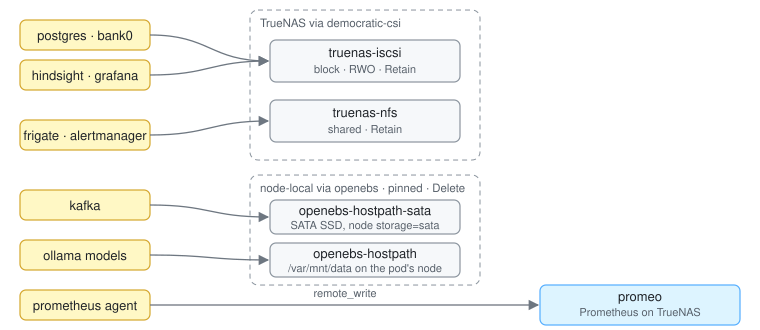

# Storage

State on TrueNAS. Node-local disk only where speed beats durability: Kafka (accepts
loss) and the Ollama model cache (re-pullable). iSCSI ≈ 1GbE, ~125 MB/s.



- **democratic-csi** — iSCSI (block) + NFS (shared) from TrueNAS; creds via
  `ExternalSecret`; setup in [democratic-csi/README.md](../kubernetes/apps/democratic-csi/README.md).
  `reclaimPolicy: Retain`: deleting a PVC or the cluster never deletes data.
- **openebs** — hostpath, pinned to the creating node, dies with it. Kafka on
  `openebs-hostpath-sata` (`/var/mnt/sata`, node `storage=sata`); Ollama cache on
  `openebs-hostpath` (`/var/mnt/data` on the GPU node = Talos EPHEMERAL partition).
- **Metrics** not stored in-cluster: Prometheus agent remote-writes to `promeo`; Thanos
  Ruler evaluates rules there, alerts into in-cluster Alertmanager.

## What survives what

| Event | TrueNAS PVs | Node-local PVs |
|---|---|---|
| Pod restart | same data | same data |
| Node drain | reschedule | Pending until node returns |
| Node loss / reprovision | reschedule | lost, recreated empty — [node loss](runbooks/node-loss.md) |
| Cluster rebuild | reclaimed — [cluster rebuild](runbooks/cluster-rebuild.md) | lost |
| TrueNAS disk loss | lost (no VolSync yet) | intact |

```sh
kubectl get pv -o custom-columns='CLAIM:.spec.claimRef.namespace,NAME:.spec.claimRef.name,SC:.spec.storageClassName,NODE:.spec.nodeAffinity.required.nodeSelectorTerms[0].matchExpressions[0].values[0]'
```
